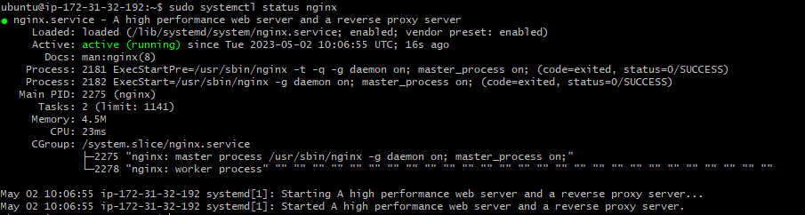
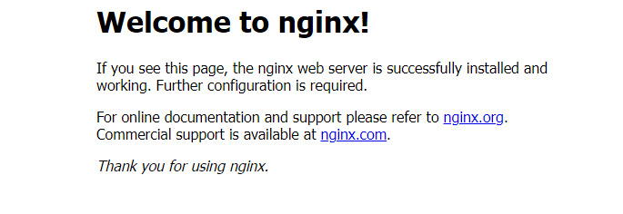
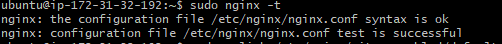
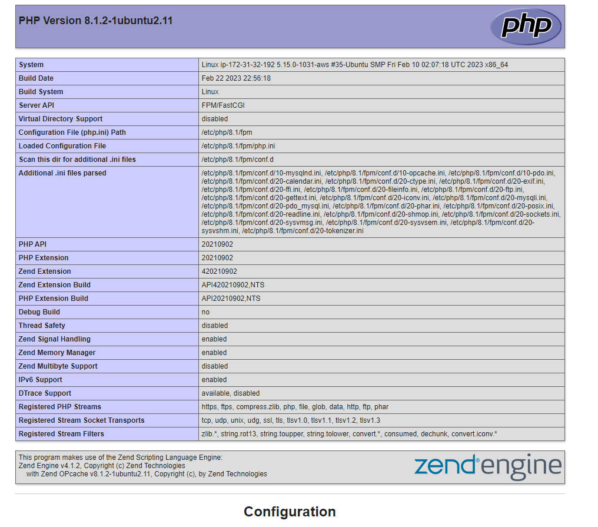
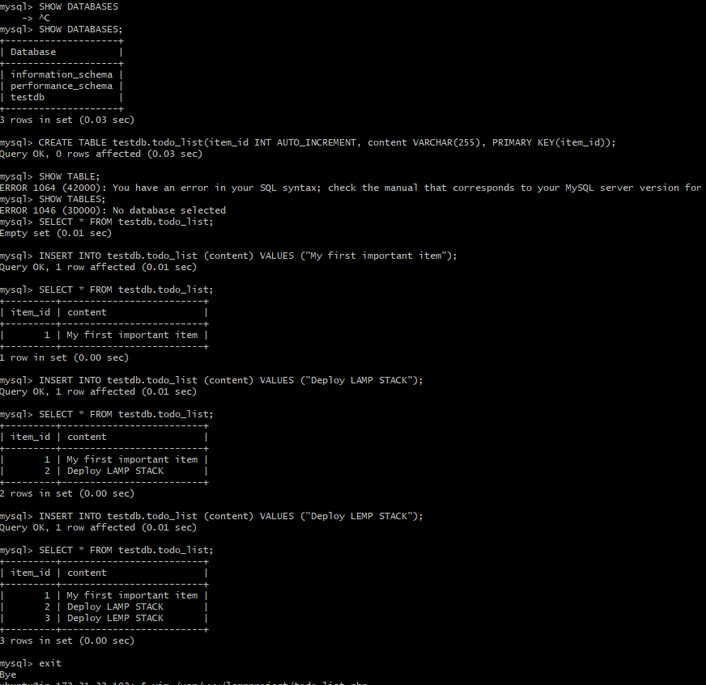
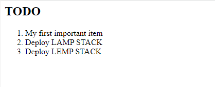

# LEMP STACK IMPLEMENTATION

For this project, I will be deploying a LEMP STACK 
LEMP- Linux, Nginx, Mysql, PHP

## 1. STEP 1- INSTALLING THE NGINX WEB SERVER

An AWS EC2 instance is running with Ubuntu OS. 
To begin, I installed nginx web server using the following commands:
`sudo apt update` 
`sudo apt install nginx`

The Nginx status is checked using the following command:
`sudo systemctl status nginx`

The status message: 

Note: Open port 80, to allow inbound connections.

I tested the nginx server by requesting it via a web browser, and it was up and running.


## 2. INSTALLING MYSQL
Now that the webserver is up and running a I'll be installing a DBMS (MYSQL) to store and manage data for the site. 

Mysql is installed using the following command: `sudo apt install mysql-server`

After installation and validation, A password is set for the root user, using mysql_native_password as default authentication method with the following command: 
`ALTER USER 'root'@'localhost' IDENTIFIED WITH mysql_native_password BY '<insert_your_password>'`

The following command is recommended to remove some insecure default settings and lock down access to the database system. `sudo mysql_secure_installation`

## 3. INSTALLING PHP

NGINX has been installed to serve content and MySQL installed to store and manage the data. PHP will now be installed to process code and generate dynamic content for the webserver.

While Apache embeds the PHP interpreter in each request, Nginx requires an external program to handle PHP processing and act as a bridge between the PHP interpreter itself and the web server. This allows for a better overall performance in most PHP-based websites, but it requires additional configuration. This allows for better performance in most PHP-based websites, but it requires additional configuration. 

I'll neeed to install **php-fpm**, which stands for "PHP fastCGI process manager", and tell nginx to pass PHP requests to this software for processing. Additionally, **php-mysql** will be needed which is a PHP module that allows PHP to communicate with MySQL based databases. 

The following command is used to install these packages:

`sudo apt install php-fpm php-mysql`

## 4. CONFIGURING NGINX TO USE PHP PROCESSOR

When using the nginx web server, we can create server blocks (similar to virtual hosts in apache) to encapsulate configuration details and host more than one domain on a single server. 
A root web directory is created using the command `sudo mkdir /var/www/lempproject`

Next I assign the ownership of the directory to my current user `sudo chown -R $USER:$USER /var/www/lempproject`

I created a new configuration file in apache's site-available directory using vim: `sudo vim /etc/nginx/sites-available/lempproject.conf`
The following command config was written in the file: 
```
#/etc/nginx/sites-available/projectLEMP

server {
    listen 80;
    server_name projectLEMP www.projectLEMP;
    root /var/www/projectLEMP;

    index index.html index.htm index.php;

    location / {
        try_files $uri $uri/ =404;
    }

    location ~ \.php$ {
        include snippets/fastcgi-php.conf;
        fastcgi_pass unix:/var/run/php/php8.1-fpm.sock;
     }

    location ~ /\.ht {
        deny all;
    }

}
```
The configuration is activated by linking to the config file from nginx's sites enabled directory suing the following command: 
`sudo ln -s /etc/nginx/sites-available/lempproject /etc/nginx/sites-enabled/`

The configuration file is tested for syntax errors using the command: `sudo nginx -t`

Test validation was okay: 

I created an index.html file in the web root (/var/www/lempproject) to test that my new server block works as expected using the following command: 
`sudo echo 'Hello LEMP from hostname' $(curl -s http://169.254.169.254/latest/meta-data/public-hostname) 'with public IP' $(curl -s http://169.254.169.254/latest/meta-data/public-ipv4) > /var/www/lempproject/index.html`

This was tested on my browser (http://<Public-IP-Address>:80) and the result is : 

## 5. TESTING PHP WITH NGINX 

The LEMP stack is now completely set up and now to test that the nginx can correctly handle .php files off to the processor. 

I will do this by creating a PHP file in my document root using the command `sudo vim /var/www/lempproject/info.php`
and the following code is written to return info about the server: 
<?php
phpinfo();

Testing this out on the web browser using the URL ('http://`server_domain_or_IP`/info.php'). 
Information about the webserver is displayed 

## 6. RETRIEVING DATA FROM MYSQL DATABASE WITH PHP

I will be creating a test database with simple 'To do list' and configure access to it, so the nginx website would be able to query data from the DB and display it. 

First I connect to mysql `sudo mysql`

I created a new database called **testdb** using the command `CREATE DATABASE `testdb`;`
Next, I created a user and granted full priviledges on the database using the command: `CREATE USER 'user_one'@'%' IDENTIFIED WITH mysql_native_password BY 'password';`

Now to grant all permissions I use the command `GRANT ALL ON example_database.* TO 'example_user'@'%';`

Testing if the new user has the proper permissions by logging into mysql using the credentials created `mysql -u user_one -p`

The follwing commands and output run in mysql are shown: 

After creating the testdb and inserting values into it as shown in the figure above, I will be creating a PHP script to connect to MySQL and query it for the content. 

I created a new php file using the command: `vim /var/www/lempproject/todo_list.php`

The following PHP script connects to the MySQL database and queries for the content of the todo_list table, displays the results in a list. If there is a problem with the database connection, it will throw an exception:

<?php
$user = "example_user";
$password = "password";
$database = "example_database";
$table = "todo_list";

try {
  $db = new PDO("mysql:host=localhost;dbname=$database", $user, $password);
  echo "<h2>TODO</h2><ol>";
  foreach($db->query("SELECT content FROM $table") as $row) {
    echo "<li>" . $row['content'] . "</li>";
  }
  echo "</ol>";
} catch (PDOException $e) {
    print "Error!: " . $e->getMessage() . "<br/>";
    die();
}

Testing this in the url 'http://<Public_domain_or_IP>/todo_list.php'. The following webpage is displayed 

The PHP environment is readt to connect and interact with the SQL server. 